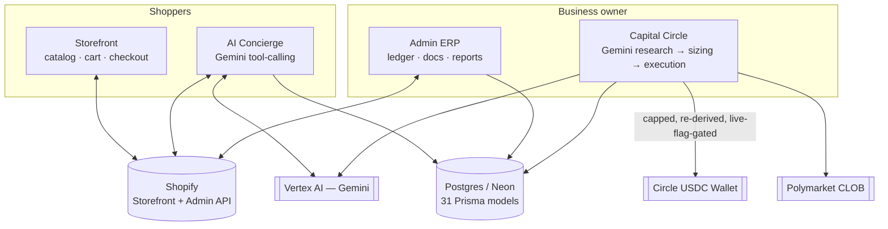

# NURU Electronics — Platform

A production e-commerce platform for [NURU Electronics](https://www.nuruelectronics.com), a Kenyan electronics retailer, built on Next.js 16 + Shopify. It is one codebase running four distinct products against one shared Postgres database:

1. **Storefront** — the Shopify-backed shop itself: catalog, cart, checkout handoff, BNPL financing, semantic search, a secondhand "Ex-UK" marketplace mode, and customer accounts.
2. **AI Concierge** — a Gemini tool-calling shopping assistant with real authority: it looks up orders, searches the catalog semantically, hands off to WhatsApp, and autonomously approves or denies returns/refunds under a fixed, human-written policy — never an LLM judgment call.
3. **Admin ERP** — a full lightweight back office for running the business: orders, estimates/invoices/receipts/delivery notes, expenses, supplier bills, payroll, petty cash, a real double-entry general ledger, and thirteen financial/operational reports, with a Google Sheets sync for external reporting.
4. **Capital Circle** — an autonomous trading agent that researches short-horizon Polymarket prediction markets with Gemini, sizes positions under hard-coded, re-derived risk caps, and (only once explicitly enabled) executes real trades from a Circle USDC wallet — with every money-movement step either capped in code, destination-pinned, or requiring a human to confirm it.

Built for the **Build with Gemini XPRIZE**.

## Table of contents

- [Why this shape](#why-this-shape)
- [Architecture at a glance](#architecture-at-a-glance)
- [The four products, in depth](#the-four-products-in-depth)
  - [1. Storefront](#1-storefront)
  - [2. AI Concierge](#2-ai-concierge)
  - [3. Admin ERP](#3-admin-erp)
  - [4. Capital Circle](#4-capital-circle)
- [How the AI agents are kept safe](#how-the-ai-agents-are-kept-safe)
- [Database schema](#database-schema)
- [Scheduled jobs](#scheduled-jobs)
- [Integrations](#integrations)
- [Tech stack](#tech-stack)
- [Project structure](#project-structure)
- [Getting started](#getting-started)
- [Environment variables](#environment-variables)
- [Deployment](#deployment)
- [Operational pitfalls — read before debugging Capital Circle](#operational-pitfalls--read-before-debugging-capital-circle)
- [Known limitations](#known-limitations)

## Why this shape

This isn't a demo storefront with an AI chatbot bolted on. It's a real small business's actual operating system: NURU's owner uses `/admin` daily to invoice customers, track expenses, and run payroll, and Capital Circle exists to autonomously grow a trading fund from a percentage of the store's real weekly profit. The AI concierge and Capital Circle share the same architecture — a bounded Gemini tool-calling loop with a fixed system prompt and an explicit dispatch table of allowed actions — applied to two very different domains (customer support vs. financial trading). Neither agent is trusted to make a financial decision on its own: the model proposes, code disposes.

## Architecture at a glance



Shopify is the system of record for the catalog and orders; Postgres (via Prisma) is the system of record for everything money-related — the ledger, documents, payroll, and Capital Circle's isolated position/wallet data. The concierge and Capital Circle are architecturally the same loop pointed at different tool sets and different stakes.

## The four products, in depth

### 1. Storefront

- **Catalog/cart** (`src/lib/shopify/index.ts`) wraps the Shopify Storefront GraphQL API (`2024-10`). It ships a **full mock-data fallback** (`mock-data.ts`) that activates automatically when Shopify credentials are unset, including a mock in-memory cart and a client-side query matcher that parses the same `product_type:"X" AND tag:y` syntax the real facet builders generate — the app runs and is demoable with zero external credentials.
- Shopper-typed free text is sanitized (`sanitizeFreeTextSearchTerm()`) to strip Shopify search-syntax metacharacters before being merged into structured queries — closes a search-scope-escape where a query like `") OR (tag:ex-uk"` could break out of the app's own `-tag:ex-uk`/`-tag:coming-soon` exclusions.
- **Checkout** (`src/lib/checkout.ts`) detects the mock-mode placeholder checkout domain and falls back to a WhatsApp order button everywhere a checkout link appears (cart, PDP, concierge), rather than surfacing a dead URL.
- **BNPL financing** (`src/lib/bnpl.ts`, `bnpl-rates.ts`) runs two pricing tiers: a **formula tier** for Apple phones/tablets/laptops specifically (weekly: 40% deposit over 12 weeks; monthly: 50% deposit over 3 months; balance marked up 1.5x), and a **lookup tier** for Samsung/Google/OnePlus/Nothing priced off a fixed partner rate-card (3- or 6-month plans). The UI is careful to always quote total cost (deposit + every installment), not the tier-dependent `totalPayable` field, as "what you'll pay in total."
- **Semantic search** (`src/lib/search/semantic-search.ts`) embeds the catalog nightly with Vertex AI's `text-embedding-004` (stored as a Postgres `Float[]` column — no pgvector dependency), ranks by cosine similarity plus a title-match boost, and filters below a relevance floor so a longer, spec-heavy embedding can't dilute similarity and let accessories crowd out the actual product family a shopper searched for.
- **Ex-UK marketplace** (`src/app/ex-uk/*`) is a separate, full-screen swipeable "discover" mode over the same catalog (filtered to `tag:ex-uk` secondhand stock), computing savings against the equivalent new listing and shipping its own FAQPage structured data.
- "Gaming" is a standard product category (consoles, accessories, peripherals, games, gift cards), fulfilled as ordinary Shopify products — there is no third-party game-key/marketplace integration.

### 2. AI Concierge

- **Loop** (`src/lib/concierge/agent-loop.ts`): a Gemini (`gemini-2.5-flash`) tool-calling loop, streamed, capped at 6 tool iterations per turn, emitting typed SSE-style events (`text-delta`, `products`, `cart`, `checkout`, `whatsapp`, `done`, `error`).
- **Anti-hallucination forcing**: the first iteration of a turn is forced into restricted, read-only-catalog function-calling mode whenever the latest message matches a product-model pattern (e.g. "iPhone 17") or an availability keyword ("in stock", "do you have", "compare") — a direct guard against the model inventing product facts instead of looking them up.
- **13–14 tools** spanning catalog search/compare, cart mutation, checkout, BNPL explanation, Ex-UK savings, order status, return/refund filing, and a conditional WhatsApp handoff (only declared when a WhatsApp number is configured).
- **Returns/refunds policy** (`src/lib/support/return-policy.ts`) is a pure, side-effect-free function mirroring the published refund policy — not an LLM judgment call. Change-of-mind: 7-day window. Damaged/wrong/missing: 48-hour window, but past-window claims are **escalated, not denied**, since they could still be a warranty defect. Warranty: 365 days. A committed refund posts a ledger accrual (debit Sales Returns / credit Refunds Payable) atomically with the case record.
- **Rate limiting**: 8 requests/minute per IP on the unauthenticated concierge endpoints, since each turn drives multiple paid Vertex calls.
- **Memory**: signed-in shoppers' conversation history persists in Firestore, trimmed to the last 30 messages; guests get an ephemeral, unsaved conversation.

### 3. Admin ERP

`/admin` covers orders (manual + Shopify-synced), estimates/invoices/receipts/delivery notes (PDF-generated and emailable), expenses, supplier bills, a fixed-asset register, payroll (employees + runs), petty cash, a full chart-of-accounts general ledger, and **thirteen reports**: P&L, income statement, balance sheet, trial balance, cash book, debtors, creditors, tax, fixed assets, sales, payroll, AI-attribution (concierge-assisted checkout tracking), and riders' delivery impact (a job-creation metric — active riders, deliveries completed, total payroll paid — deliberately built as "real, countable" evidence of local economic impact).

- **Ledger** (`src/lib/ledger.ts`): a fixed chart of accounts seeded once at setup; every posting runs inside the same database transaction as the business event that triggered it, and validates debits equal credits before writing. Documents get sequential human-readable numbers (`INV-2026-0001`) minted atomically alongside the document itself.
- **Auth** (`src/proxy.ts` + `src/lib/admin-auth.ts`): the edge proxy redirect is treated as an *optimistic* convenience only — every admin Server Component and Server Action independently re-checks the session, because proxy matchers can silently miss Server Function calls. Sessions are HMAC-SHA256-signed, constant-time-verified, 12-hour-lived, httpOnly cookies. Failed logins lock out after 5 attempts in 15 minutes, per IP.
- **Audit log**: destructive or financial admin actions write to a dedicated audit trail, optionally inside the same transaction as the mutation they record.

### 4. Capital Circle

```mermaid
flowchart LR
    A["Screen (code)<br/>liquidity, volume, spread,<br/>price band, horizon mix"] --> B["Ground<br/>one grounded search pass<br/>for recent news"]
    B --> C["Score (model ×3)<br/>price the WHOLE slate,<br/>take the median"]
    C --> D["Select (code)<br/>edge vs the ask, shrunk<br/>by measured calibration"]
    D --> E["Verify (model)<br/>order book + price history;<br/>may veto, cannot add"]
    E --> F["Execute<br/>re-prices, re-gates,<br/>Kelly-sizes"]
    F -->|only if LIVE + configured + mainnet| W[(Circle USDC Wallet)]
    W --> P[Polymarket CLOB<br/>Fill-Or-Kill market order]
```



One hourly pipeline (`src/lib/capital-circle/agent-loop.ts`). The organising principle is that **the model estimates probabilities and code decides what to trade** — the two were fused in an earlier design, and an estimate formed while looking for a reason to trade is not an estimate.

- **Screening** (`candidate-filter.ts` / `polymarket-client.ts`): queries Polymarket's public Gamma API directly (not the CLOB's own market-listing call, which can't filter by resolution time) for markets resolving within 24 hours, ordered by 24-hour volume, then drops anything failing liquidity, volume, spread or price-band floors. Part of the slate is reserved for markets resolving further out, since a pure volume ranking is dominated by hourly crypto ticks that are close to coin flips. Untradeable markets are made unpickable rather than merely discouraged.
- **Scoring** (`system-prompt.ts` / `ensemble.ts`): the model prices *every* candidate — not just ones it wants to trade — three times at temperature, and the median is taken. Pricing the whole board is what makes calibration measurable without the model's own selection bias; sampling several times is what stops a single hallucinated 0.95 from becoming a position. Where the samples disagree widely, the estimate is discarded as unstable rather than averaged into false confidence.
- **Selection** (`trade-policy.ts`): each estimate is shrunk toward the market price (the base rate set by people with money at risk), compared against the *ask* plus modelled costs, and traded only if the resulting edge clears a floor. Positions are deduplicated by market and by event, since two outcomes of one event are one wager.
- **Sizing** (`sizing-tool.ts`): fractional (quarter) Kelly on the trade's own edge, clamped by the per-position cap, daily/weekly/monthly velocity, total portfolio exposure, a maximum open-position count, and a share of resting book depth. A drawdown circuit breaker pauses trading entirely after a bad enough run, and only a human can lift it.
- **Execution** (`executor-tool.ts`): the only tool with wallet-signing authority. It **re-derives** everything from ground truth rather than trusting the model — re-pricing against the live order book, re-checking the edge at those real prices, and re-computing the size — closing a prompt-injection path where a confused or compromised model could otherwise record more than the caps allow. Live trading requires all three of `CAPITAL_CIRCLE_LIVE=true`, a fully configured Circle wallet, and *not* being on testnet; anything less records a `simulated` position at the ask-side price a real order would have crossed to.
- **Learning** (`track-record.ts` / `calibration.ts` / `policy-eval.ts`): every candidate the desk ever priced is stored and labeled with its real outcome once the market closes. That yields a Brier score and per-band calibration measured over markets it *passed on* as well as ones it traded — which feeds back into the next cycle's prompt, and mechanically adjusts how much the sizing code trusts the model. It also supports replaying alternative thresholds over already-resolved markets, so tuning is a table rather than a guess.

**Staying in the market**: the desk targets `DAILY_POSITION_TARGET` positions a day (3 by default) — a floor, not a ceiling; `MAX_POSITIONS_PER_CYCLE` already allows more than that in a single hour if the market offers them. Rather than forcing a trade when nothing qualifies, the required edge *slides down* the longer it goes since the last position and the target isn't yet met — from `MIN_EDGE` after 6 hours to `MIN_EDGE_WHEN_HUNGRY` by 20 — and the deep-dive prompt correspondingly restricts vetoes to hard factual problems rather than mere thinness. That relaxation resets after every position taken, so it applies the same way whether the desk is chasing its first trade of the day or its third. The relaxed bar never reaches zero: a trade with no expected value isn't a position, it's a donation, so a genuinely empty day still ends in no trade and says so in the cycle log.

**Hard-coded caps:**

| Cap | Default | Enforced in |
|---|---|---|
| Per Polymarket position | $25 (overridable per-wallet) | `sizing-tool.ts` |
| Positions opened per cycle | 4 | `trade-policy.ts` |
| Concurrent open positions | 12 | `sizing-tool.ts` |
| Total open exposure | $300 | `sizing-tool.ts` |
| Trailing-week drawdown before pausing | $75, or 6 straight losses | `sizing-tool.ts` |
| Share of resting book depth per order | 10% | `trade-policy.ts` |
| Kelly fraction | half-Kelly on the shrunk probability | `trade-policy.ts` |
| Daily / weekly / monthly velocity | unset until a real wallet configures them | `sizing-tool.ts` |
| Binance → Circle wallet withdrawal | $10 per call | `binance-client.ts` |
| Circle wallet → Binance withdrawal | $10 per call | `circle-wallet-withdraw.ts` |
| x402 paid-resource call | $0.50 per call | `x402-pay.ts` |
| Weekly profit sweep | 40% of that week's real profit | `config.ts` |

Every fund-moving function pins its destination to a fixed, environment-configured address — never a caller-supplied one — so no code path, even a compromised one, can redirect money anywhere else. The one deliberate exception is x402 payments, where the payee is protocol-determined; those can optionally be pinned per-host.

**Weekly profit sweep**: reuses the exact same P&L computation as the admin report, over the prior Monday–Sunday window, and stages `40%` of any real profit as a proposal — never converts currency or moves money automatically. A human converts USD→USDC and funds the wallet manually, then confirms the amount received in `/admin/reports/capital-circle`. Circle's webhook notifications (ECDSA-signature-verified, over the raw request body, against a cached public key) can only *pre-fill* that confirmation with a detected amount — never flip it to confirmed on their own.

**Isolation**: Capital Circle's positions, wallet, and sweep records are deliberately separate Prisma models from the core ERP ledger — the trading pool can only ever lose what's already inside it, and has no claim on the core business's books.

## How the AI agents are kept safe

Both Gemini-driven agents in this codebase follow one principle end to end: **the model proposes, code disposes.**

- **Re-derivation over trust**: the one function with actual money-moving authority in each pipeline (`recordPosition()` for Capital Circle, `decideReturnCase()` for the concierge) never accepts the model's numbers/decisions as final — it recomputes them itself from ground truth (the live order book and the wallet's caps; the published refund policy), so a model that's confused, misled, or prompt-injected can't move more money or approve more than a human-written rule allows. Capital Circle extends this past safety into profitability: the model cannot pick which market to trade, only estimate probabilities and veto trades the code proposed — a trade whose edge doesn't survive re-pricing at the real ask is refused no matter how good the thesis reads.
- **Fail-closed allowlisting**: x402 payments require an explicit per-host allowlist that is empty by default — nothing is payable until an operator opts a host in.
- **Destination pinning**: every fund transfer between Binance and the Circle wallet uses a fixed, environment-configured address in both directions, never one supplied at call time.
- **Independent, layered caps**: every money-moving function enforces its own app-level ceiling regardless of what the underlying API key or wallet policy technically permits — a second, independent layer, not a substitute for provider-side controls.
- **Signature verification everywhere a request claims authority**: admin sessions (HMAC-SHA256, constant-time compare), Circle webhooks (ECDSA over the raw body against a cached public key), and every cron/scheduler route (bearer-token compare) all share one constant-time-comparison helper to avoid timing side-channels.
- **Concurrency safety**: the hourly Capital Circle cycle takes a Postgres advisory lock before running, since it's hit redundantly by both Vercel Cron and GCP Cloud Scheduler — an overlapping run is skipped, not queued, so two cycles can never race against the same spending cap before either's spend is visible to the other.
- **Idempotency**: the weekly sweep upserts on the week's start date, so re-running the cron for an already-swept week is safe. Ledger postings validate debits equal credits before ever writing a row.
- **Testnet/mainnet separation is a hard code fork, not a flag check**: a testnet-configured wallet cannot sign for the real Polymarket CLOB, and the executor's live-eligibility check explicitly requires *not* being on testnet in addition to the live flag and wallet configuration — the two settings must never be combined.
- **Everything logs**: every state-changing action — a trade, a refund, an expense, a payment — writes to an audit trail and, wherever money is involved, a balanced double-entry ledger entry, so the books are always reconstructable independent of what any agent claims happened.

## Database schema

Postgres via Prisma, 31 models across seven groups (`prisma/schema.prisma`):

| Group | Models |
|---|---|
| Customers & orders | `Customer`, `Order`, `OrderItem` |
| Quote-to-cash documents | `Estimate`, `Invoice`, `Receipt`, `DeliveryNote`, `DocumentSequence` |
| Expenses & ledger | `Expense`, `Account`, `JournalEntry`, `JournalLine` |
| Petty cash | `PettyCashFund`, `PettyCashEntry` |
| Creditors (accounts payable) | `Supplier`, `Bill`, `SupplierPayment` |
| Assets & payroll | `FixedAsset`, `Employee`, `PayRun`, `Payslip`, `PayslipDeduction` |
| Security, search & support | `AdminLoginAttempt`, `ConciergeRequestLog`, `AdminAuditLog`, `Settings`, `ProductEmbedding`, `ReturnCase` |
| Capital Circle (isolated) | `CapitalCircleWallet`, `CapitalCirclePosition`, `CapitalCircleSweep` |

## Scheduled jobs

| Route | Schedule | Trigger | Purpose |
|---|---|---|---|
| `/api/cron/sync-pnl` | daily 05:00 UTC | Vercel Cron | Posts monthly depreciation, pushes year-to-date P&L to Google Sheets |
| `/api/cron/invoice-reminders` | daily 06:00 UTC | Vercel Cron | Emails a reminder + PDF for invoices overdue and not reminded in the last 3 days |
| `/api/cron/sync-product-embeddings` | daily 04:00 UTC | Vercel Cron | Recomputes Vertex AI embeddings for the whole catalog |
| `/api/cron/profit-sweep` | Mondays 05:00 UTC | Vercel Cron | Computes last week's Capital Circle profit sweep, emails it for confirmation |
| `/api/cron/product-readiness` | daily 08:00 UTC | GCP Cloud Scheduler | Flags active Shopify products missing an image, real price, real description, or SEO fields |
| `/api/cron/capital-circle-cycle` | hourly | GCP Cloud Scheduler (redundant with Vercel Cron on some deployments) | Runs the research → sizing → execution trading cycle, guarded by a Postgres advisory lock |
| `/api/cron/capital-circle-settle` | every minute | GCP Cloud Scheduler | Settlement only (no Gemini call) — checks open positions against Polymarket and scores win/loss as soon as a market closes, instead of waiting for the next hourly cycle |

Every cron route shares one auth pattern: a `CRON_SECRET` bearer token, compared in constant time, 401 on mismatch. See [Known limitations](#known-limitations) for one scheduled entry that currently has no implementation behind it.

## Integrations

- **Shopify** — Storefront API (catalog/cart) and Admin API (orders, inventory, product data), both with graceful degradation to mock data when unconfigured.
- **Google Vertex AI (Gemini)** — concierge chat/tool-calling and voice, Capital Circle's research/reasoning, and catalog embedding generation — all through `@google/genai`'s built-in Vertex mode, no separate Vertex SDK.
- **Circle Developer-Controlled Wallets** — the USDC wallet Capital Circle trades from; also used for x402 micropayments via EIP-3009 signed authorizations.
- **Polymarket CLOB** — order placement for Capital Circle's live trades.
- **Binance** — the funding source that tops up the Circle wallet, and the destination for withdrawing back out, both capped and destination-pinned.
- **Google Sheets** — the P&L sync target, matched by text label against a shared template rather than fixed cell coordinates.
- **Firestore** — signed-in shopper conversation memory for the concierge, reusing the same service-account credentials as Vertex AI and Sheets.
- **Resend** — transactional email and PDF-document delivery (invoices, reminders, sweep notices, cycle summaries, readiness reports).
- **WhatsApp** — implemented as `wa.me` deep-links (no Business API/Twilio dependency): concierge handoff, BNPL applications, and order fallbacks when Shopify checkout isn't usable.

## Tech stack

- **Next.js 16.2.10** (App Router, Server Actions/Functions), **React 19.2.4**, **TypeScript 5** (`strict: true`)
- **Prisma 7.8.0** with the `@prisma/adapter-pg` driver-adapter model (not the legacy binary engine) on **Postgres** (Neon)
- **Shopify** Storefront + Admin GraphQL APIs (`2024-10`)
- **`@google/genai`** for all Vertex AI access (concierge, Capital Circle, embeddings) — `gemini-2.5-flash` for chat/reasoning, `gemini-2.5-flash-preview-tts` for concierge voice, `text-embedding-004` for search
- **`@circle-fin/developer-controlled-wallets`**, **`viem`**, **`@polymarket/clob-client-v2`** for the Capital Circle wallet/trading stack
- **`resend`**, **`googleapis`**, **`firebase-admin`**, **`qrcode`**, **`@react-pdf/renderer`**, **`recharts`**
- Node **22.x** pinned via `engines`; ESLint 9 flat config (`eslint-config-next`); Tailwind CSS 4
- Deployed on **Vercel**, with Vercel Cron and GCP Cloud Scheduler both driving different cron routes (see [Scheduled jobs](#scheduled-jobs))

## Project structure

```
src/app/(storefront)/         Shop: catalog, cart, checkout, search, BNPL, account, legal pages
src/app/admin/                Back office: orders, documents, ledger, payroll, 13 reports, settings
src/app/ex-uk/                "Ex-UK" — swipeable, chat-per-product discovery over secondhand stock
src/app/api/cron/             Scheduled job targets (see Scheduled jobs above)
src/app/api/webhooks/         Signed-webhook receivers (Circle wallet deposit notifications)
src/app/api/concierge/        Concierge chat + voice-turn endpoints
src/app/api/reports/          CSV export endpoints for every admin report
src/app/api/{estimates,invoices,receipts,payslips,delivery-notes}/  PDF generation + public response links
src/lib/shopify/              Storefront + Admin API clients, with a full mock-data fallback
src/lib/concierge/            Gemini tool-calling loop, catalog/support/BNPL tools, system prompt, rate limiting
src/lib/capital-circle/       Research, sizing, execution, wallet client, Binance bridge, weekly sweep, x402
src/lib/support/              Return/refund policy logic (pure, testable, no I/O)
src/lib/reports/              P&L, trial balance, balance sheet, cash book, and every other report's computation
src/lib/ledger.ts             Double-entry journal posting shared by every money-touching action
src/lib/search/               Semantic product search (Vertex embeddings + cosine similarity)
src/proxy.ts                  Edge-level admin auth redirect + site-wide maintenance-mode gate
prisma/                       Schema (31 models) + migrations + seed
scripts/                      One-off verification/setup scripts (Circle wallet provisioning, testnet checks, product readiness) + quality/ collectors (churn, duplication, dependency graph, scoring)
docs/quality/                 Code-quality rubric, reports, and trend log — see docs/quality/README.md
.github/workflows/quality.yml Per-PR deterministic quality gate (typecheck, lint, circular-import check)
.claude/skills/code-quality-audit/  The weekly/on-demand deep design-review skill
```

## Getting started

```bash
npm install
cp .env.local.example .env.local   # fill in what you need — see below
npm run dev
```

Open [http://localhost:3000](http://localhost:3000). Admin back office is at `/admin` (needs `ADMIN_USERNAME`/`ADMIN_PASSWORD`/`ADMIN_SESSION_SECRET`).

## Environment variables

`.env.local.example` is the source of truth — every one of its ~150 lines documents inline what the variable does and what stays hidden/disabled until it's set. Nothing is required to run the app in a degraded-but-working state: unset a feature's credentials and that feature's UI hides itself rather than erroring (no Shopify tokens → catalog runs on mock data; no Gemini credentials → concierge widget doesn't render; no Circle wallet → Capital Circle stays in simulation mode with no funds at risk).

| Area | Needs |
|---|---|
| Storefront + cart | `SHOPIFY_STORE_DOMAIN`, `SHOPIFY_STOREFRONT_ACCESS_TOKEN` |
| Admin ERP | `DATABASE_URL`, `ADMIN_USERNAME`/`ADMIN_PASSWORD`/`ADMIN_SESSION_SECRET`, `SHOPIFY_ADMIN_API_ACCESS_TOKEN` (needs `read_products` scope if the product-readiness cron is used) |
| AI Concierge | `GOOGLE_SERVICE_ACCOUNT_EMAIL`/`PRIVATE_KEY`, `GOOGLE_CLOUD_PROJECT`/`LOCATION` |
| Capital Circle (simulated) | same Vertex AI credentials as above — no separate setup, runs in simulation with no funds at risk |
| Capital Circle (live trading) | `CAPITAL_CIRCLE_LIVE=true` **and** `CIRCLE_API_KEY`/`CIRCLE_ENTITY_SECRET`/`CIRCLE_WALLET_ID`/`CIRCLE_WALLET_ADDRESS` — any one missing keeps every cycle in simulation |
| Emailed documents & reports | `RESEND_API_KEY`, `DOCUMENT_EMAIL_FROM` |
| P&L → Google Sheets sync | reuses the Vertex AI service account, plus `PNL_SHEET_ID`/`PNL_SHEET_TAB` |
| Cron routes (any of them) | `CRON_SECRET`, checked as a bearer token by every `/api/cron/*` route |
| Product-readiness notifications | `PRODUCT_READINESS_OWNER_EMAIL` (optional — the check still runs and logs without it) |

## Deployment

- **Vercel** builds and hosts the app. `npm run build` runs `prisma migrate deploy && prisma db seed && next build` — every deploy applies pending migrations and re-seeds fixed reference data (chart of accounts, etc.) before building.
- **Vercel Cron** (`vercel.json`) drives `sync-pnl`, `invoice-reminders`, `sync-product-embeddings`, and `profit-sweep` automatically — no setup beyond having `CRON_SECRET` set.
- **GCP Cloud Scheduler** drives `product-readiness`, `capital-circle-cycle` (redundantly, alongside Vercel Cron on some deployments), and `capital-circle-settle`, since these were deliberately kept off `vercel.json`. Creating a job needs the Cloud Scheduler API enabled on the target project and a job pointed at the route with the same `CRON_SECRET` as an `Authorization: Bearer` header, e.g.:

  ```bash
  gcloud scheduler jobs create http product-readiness \
    --location=us-central1 \
    --schedule="0 8 * * *" \
    --uri="https://<your-domain>/api/cron/product-readiness" \
    --http-method=GET \
    --headers="Authorization=Bearer <CRON_SECRET>"
  ```

  `capital-circle-settle` is the same shape but on a 1-minute schedule (Cloud Scheduler's finest cron granularity) — it's cheap since it never calls Gemini, just Polymarket's public API and a DB write per resolved position:

  ```bash
  gcloud scheduler jobs create http capital-circle-settle \
    --location=us-central1 \
    --schedule="* * * * *" \
    --uri="https://<your-domain>/api/cron/capital-circle-settle" \
    --http-method=GET \
    --headers="Authorization=Bearer <CRON_SECRET>"
  ```

## Operational pitfalls — read before debugging Capital Circle

Every item below cost real time to diagnose once. Each is a case where the honest-looking evidence pointed the wrong way. Read this before concluding "the cron isn't running" or "the migration didn't apply."

### You are probably not looking at Production's database

Vercel's Neon integration provisions a **separate database branch per environment**. The `DATABASE_URL` in a local `.env.local` — even one that was `vercel env pull`'d — can point at a preview/dev branch, not Production, even though it has real-looking business data (Neon branches are created as a copy of the parent at branch time, so old orders and positions carry over and then diverge silently).

This is *not* obvious from inspection: the wrong branch can have the right hostname pattern, real rows, and even receive schema migrations that appear to succeed — while Production, on its own branch, quietly does something else entirely. Symptoms that should make you suspect this rather than "the feature is broken":

- A cron route returns a real, well-formed success response (e.g. a fresh `cycleId`), but querying for that exact ID in "your" database returns nothing.
- The admin dashboard (served by the real app, against the real database) shows activity that never shows up no matter how you query the database you have credentials for.

**The reliable check**: trigger the route in question and take the ID it returns (e.g. `cycleId` from `capital-circle-cycle`). Look that *exact* ID up in the database you're about to trust. If it's not there, stop — you are not looking at Production, and no migration, seed, or fix applied there is real until you find the right one. Comparing just the Neon endpoint id (the `ep-xxxxxxx` segment of the host, not the full credentialed URL) between your local file and Vercel's Production environment variable is enough to confirm a match or a mismatch without needing the password.

### A GCP Cloud Scheduler job can report healthy while doing nothing

If a job's `--uri` points at a host that redirects (e.g. the apex domain when the site canonicalizes to `www`), the job can fire on schedule, "succeed," and the target application never runs — Cloud Scheduler does not reliably follow redirects for HTTP targets. `gcloud scheduler jobs describe` is not sufficient to catch this: its cached `status` field can show empty (which reads as healthy) even when every execution has been a no-op for days.

The only trustworthy check is the actual per-execution log, which records the real HTTP outcome:

```bash
gcloud logging read 'resource.type="cloud_scheduler_job" AND resource.labels.job_id="capital-circle-cycle"' \
  --project=<project> --limit=5 --format=json
```

Look at `httpRequest.status` and `jsonPayload.debugInfo` (e.g. `"URL_CRAWLED. Original HTTP response code number = 200"`) for what the target actually returned — not just whether Scheduler considers the attempt complete. Before wiring a job to a URI, confirm it isn't a redirect: `curl -I <uri>` should return `200`, not `3xx`.

Relatedly: `gcloud scheduler jobs create` fails safely with `ALREADY_EXISTS` if the job is already there — it will never silently overwrite a working config. To change an existing job's target (e.g. fixing a bad domain), use `gcloud scheduler jobs update http <name> --uri=...` instead. Don't copy-paste an old `create` snippet with a stale URI and switch it to `update` without checking the URI first.

### Never let `CRON_SECRET` (or any bearer token) appear in a command you might paste or share

`CRON_SECRET` authorizes every `/api/cron/*` route, including the ones that place trades. Any command that puts it inline — `--headers="Authorization=Bearer <secret>"`, a `curl -H` you're about to share for debugging — leaves it in shell history and in anything that reads that output. Prefer commands that describe config without dumping headers, e.g. `gcloud scheduler jobs describe <name> --format="value(httpTarget.uri, state)"`. **If it's ever displayed in a shared terminal or chat, treat it as compromised**: rotate it in Vercel's environment variables, then update the header on every scheduler job that uses it.

### Migration history can diverge from what a given database branch actually has

`prisma migrate status` reporting drift on a database with real data is not a green light for `prisma migrate dev` — that command's fix for drift is to offer a **reset**, which is destructive. If migrations are missing from history but their columns/tables/indexes already exist (checkable via `information_schema.columns`/`.tables`), the safe repair is `prisma migrate resolve --applied <migration_name>` for each one, confirmed individually against `information_schema` first — never assumed. Only after history is reconciled should `prisma migrate deploy` run for the genuinely new migration. This is exactly the sequence used to apply `20260820120000_add_capital_circle_intelligence` safely to a branch with pre-existing divergence.

## Code quality

Two speeds, deliberately separated. A per-PR gate (`.github/workflows/quality.yml`) runs
typecheck, lint, and a circular-import check against a checked-in baseline — fast, deterministic,
no LLM in the hot path. A weekly scheduled agent runs a deep design review against the 14 named
red flags from *A Philosophy of Software Design* (Ousterhout), prioritized by an implementation
of the book's own complexity formula (C = cp·tp — duplication/fan-in weighted by git churn, not
an invented severity table). Findings land as a committed report plus GitHub issues.

Full rubric, scoring formula, and the loop's cadence: [docs/quality/README.md](docs/quality/README.md).
Run it yourself: `npm run quality:fast` (what the PR gate runs) or `/code-quality-audit diff` in
Claude Code (the deeper review, on your current branch, on demand).

## Known limitations

Documented deliberately rather than glossed over:

- **Test coverage is partial.** Vitest covers the pure decision logic in `src/lib/capital-circle/` (edge gating, Kelly sizing, settlement math, calibration) — business-critical and specifically written as pure functions to make this cheap. Nothing else in the app has test coverage yet: no integration tests against the database, no route tests, no coverage for the return/refund policy or other ERP logic. `docs/quality/trend.md` now tracks known-debt files over time as the weekly audit reviews them, rather than leaving this gap purely anecdotal.
- **One scheduled cron entry currently has no implementation.** `vercel.json` schedules `/api/cron/whatsapp-review-followup` daily, but no route file exists at that path — that entry 404s on every fire until either the route is built or the schedule entry is removed.
- **Capital Circle's webhook path is unverified against a real payload.** Circle can't deliver webhooks to a localhost endpoint, so the signature-verification and pre-fill logic have been reviewed and unit-reasoned through but not exercised against a live notification.
- **The concierge's per-IP rate limiter is approximate under concurrency** — it does a count-then-insert without row locking, which is an accepted tradeoff for a cost guardrail on an unauthenticated endpoint, not a guarantee.
