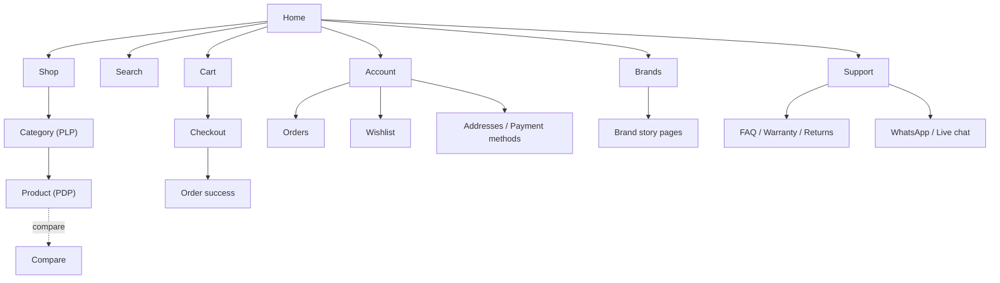
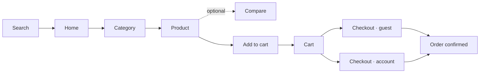
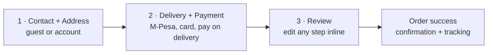

# NURU Electronics — UX Case Study & Wireframe Set (v1.0)

An IA audit and low-to-mid-fidelity wireframe set for the NURU Electronics storefront. Scope: customer-facing storefront only (`(storefront)` routes). `/admin/*` is an internal ops console and is out of scope.

Companion visual dossier (wireframe boxes, diagrams, component swatches): published as a Claude Artifact — see the session for the link, or regenerate from `docs/ux/` context.

Brand read: premium, minimal, trustworthy, editorial. Reference points: Apple, Nothing, Back Market, Muji, Arc'teryx — not Jumia/AliExpress/Temu. Single accent colour, 8pt spacing grid, large type, generous whitespace, mobile-first.

---

## 00. IA audit — what already exists, and what to do with it

Per the brief's own instruction: audit first, preserve what works, change only where there's a measurable trust/usability/conversion gain.

| Route (as built) | Reads as | Verdict | Rationale |
|---|---|---|---|
| `/` | Home | **Keep** | Structure exists; re-sequence sections toward the 12-block hierarchy below rather than rebuilding. |
| `/shop` | All-products browse | **Keep** | Legitimate distinct entry point from `/category/[slug]` — "see everything" vs. "see this department." Nav copy must make the distinction explicit so they don't read as duplicates. |
| `/category/[slug]` | Category / PLP | **Keep** | Correct model. Gap: a price-range filter was removed in a prior fix for being hardcoded in USD on a KES catalog (commit `35eecd6`). Re-add price filtering with correct KES presets rather than leaving it absent. |
| `/products/[handle]` | PDP | **Keep** | Structure present. Missing per brief: comparison table, frequently-bought-together, sticky Add-to-Cart, delivery-estimate module. Additive, not a rebuild. |
| `/compare` | Comparison tool | **Keep** | Already exists but is likely undiscoverable without a PDP entry point. Surface it from the PDP spec table instead of building a second comparison surface. |
| `/search` | Search | **Keep** | Add autocomplete, recent/popular/trending, and an explicit empty vs. no-results distinction. |
| `/cart` | Cart | **Keep** | Add free-delivery progress bar and warranty/cross-sell rail; additive to the existing summary layout. |
| `/wishlist` | Wishlist | **Extend** | Exists as a save-list. Price-drop and stock alerts, and share, are net-new capability on an existing page, not a new page. |
| `/account`, `/account/orders`, `/account/documents` | My Account | **Extend** | Thin today — orders and documents only. Addresses, saved payment methods, warranty claims, browsing history are gaps. |
| `/ecosystem/[slug]`, `/kit/[slug]` | Brand & bundle storytelling | **Keep, relabel** | This *is* the brand-story infrastructure the brief asks for under "Brands." Promote `/ecosystem` into primary nav as "Brands" rather than building a parallel `/brands` section; keep `/kit` as curated bundles linked from it. |
| `/ex-uk`, `/ex-uk/messages` | Graded/refurbished inventory + inbox | **Keep, foreground trust** | A genuine differentiator (condition-graded stock, Back Market's core model). Currently siloed under its own layout — the condition-grading and warranty language belongs inside the PDP trust module wherever an Ex-UK item is shown, not only on its own route. |
| `/trade-in` | Trade-in | **Keep** | Directly serves "increase repeat purchases." Cross-link from PDP and Account. |
| `/blog/[handle]` | Editorial | **Keep** | The bridge between the brand's social storytelling and the calm storefront. Pull one blog card into the Home editorial hero rotation. |
| `/returns`, `/support`, `/legal/*` | Policy & help, scattered | **Consolidate** | Brief wants one Support hub (FAQ, warranty, returns, delivery, chat, WhatsApp, contact). Make `/support` the hub and link out to the legal pages as detail, instead of leaving them as nav siblings. |
| `/gift-cards`, `/about`, `/careers`, `/estimates/[id]` | Utility pages | **Keep** | No conflict with the new IA; fold into footer clusters as-is. |
| `/coming-soon`, `/maintenance` | Operational states | **Keep** | Out of scope — no UX change needed. |
| `/admin/*` | Internal ops console | **Out of scope** | Back-office tool, not customer-facing storefront. Excluded entirely. |

**Net effect:** zero new top-level routes are strictly required. One relabel (`/ecosystem` → "Brands" in nav), one consolidation (Support hub fronting the legal pages), and targeted additions to five existing pages (Category filters, PDP trust/comparison modules, Search autocomplete, Cart progress bar, Account depth). Everything below is section-level design on top of an already-sound structure.

---

## 01. Sitemap

Three levels deep, maximum — a customer holding a phone never needs a fourth tap to reach a product. Home is the only page every cluster reports to; Product and Checkout are the deepest nodes, three taps from Home, by design. Footer repeats every level-2 destination plus Legal/About/Careers/Gift Cards — the safety net, never the primary path.

---

## 02. Core user flow — discover → buy

Two entry points (Home, Search) converge on Product. Compare is a side-path off Product for the subset of shoppers actively cross-shopping a spec — it never sits in the main line. Guest checkout is the default path; account creation is offered after confirmation, never required before it.

---

## 03. Design principles

| Principle | What it rules out |
|---|---|
| One accent colour | No second "sale red." Urgency (low stock, limited units) is carried by copy and a hairline border, never a second hue. |
| 8pt grid, no exceptions | Every margin, gap and touch target is a multiple of 8px. No 5px or 13px paddings anywhere in the build. |
| One idea per screen fold | Home's 12 sections are long-scroll, not tabbed — but each fold shows exactly one idea. No hero that's simultaneously a promo banner and a search bar. |
| Copy carries trust, not badges | "Genuine warranty, verified at checkout" outperforms a padlock icon. Trust badges appear once, in the footer payment row — not repeated on every card. |
| Every price screen is calm | No countdown timers, no crossed-out prices unless a real promotion exists, no pop-ups. Confidence is quiet. |

---

## 04. Component library

- **Colour:** Paper (warm off-white background), Ink (near-black text), Ink-soft (muted body text), one Accent — a warm "dawn amber," chosen because *Nuru* is Swahili for light. The accent appears only on primary actions, active states, and the wordmark.
- **Type:** a confident grotesk for display and body (Apple/Helvetica-adjacent, matching the brand's own reference points), plus a monospace face reserved for spec labels and data annotations — apt for an electronics catalog and visually distinct from the prose.
- **Spacing:** strict 8pt scale — 8 / 16 / 24 / 32 / 48 / 64 / 96px.
- **Core elements:** primary button (filled, accent), secondary button (ghost, outline), selector chip (variant/size pickers), product card (image + name + price, consistent aspect ratio across every grid in the site).

Every wireframe below is built only from these pieces — no screen invents a new pattern mid-build.

---

## 05. Home

Long-scroll, mobile-first, 12 sections. None is filler.

| # | Section | Why it exists | Priority |
|---|---|---|---|
| 01 | Search | Highest-intent shoppers skip browsing entirely. Above the fold, not behind an icon. | P0 |
| 02 | Quick categories | Thumb-reachable horizontal scroller — one tap to a department, no menu. | P0 |
| 03 | Editorial hero | One story, not a slider of five offers. Carries the brand's Kenyan cultural storytelling onto the site — the bridge from social to storefront. | P0 |
| 04 | Trust strip | Appears before any product does. A first-time visitor decides "is this real" before "is this the right laptop." | P0 |
| 05 | Trending products | Social proof of momentum; reduces "am I the only one buying here" hesitation for a new premium brand. | P1 |
| 06 | Accessories under KSh 5,000 | A low-commitment first purchase — the on-ramp to the KSh 200,000 purchase later. | P0 |
| 07 | Gaming | Named category per the catalog; visually distinct edit for scroll variety. | P1 |
| 08 | Phones | Highest-AOV, highest-search-volume category — earns its own block. | P1 |
| 09 | Audio | Second most gifted/impulse category; lighter single-row treatment. | P2 |
| 10 | Recently viewed | Personalised without being creepy — pulls a returning visitor back to their consideration set. | P1 |
| 11 | Customer reviews | Placed late deliberately — by now the visitor has seen product and price; reviews close the remaining trust gap. | P1 |
| 12 | Footer | The safety net — every link a cautious visitor might need, in one calm, low-density block. | P2 |

**Mobile shell:** top bar (menu, wordmark, search/cart icons) → search field → quick-category chip scroller → the 12 sections stacked → bottom tab bar (Home / Shop / Search / Wishlist / Account).

**Desktop adaptation:** top nav with inline category links + mega-menu on hover, search/wishlist/cart icons top-right (the desktop equivalent of the bottom tab bar), full-bleed editorial hero, and a two-column layout pairing "Trending" with "Under KSh 5,000" before the grid sections widen to 4-up.

---

## 06. Category (PLP)

Filtering that never blocks the grid.

- **Mobile:** sort control inline; filters live behind one sticky "Filter & Sort" button — never an inline filter row eating vertical space.
- **Desktop:** persistent left filter rail (Brand, Price, RAM/Storage, Condition — including New / Ex-UK graded, Availability) beside a 3-up product grid.
- **Problem it solves:** a 128-item grid is paralysing without narrowing, but a filter bar eats mobile's scarcest resource — vertical space.
- **Business objective:** faster narrowing → fewer exits from an unfiltered wall of product → higher PLP→PDP click-through.
- **Priority:** P0 — filters were removed once already for a currency bug (`35eecd6`); re-adding them correctly (KES presets, not ported USD) is the single highest-leverage fix on this template.

---

## 07. Product (PDP)

Where the KSh 200,000 decision actually happens. Every trust signal needs to be reachable without scrolling past the buy button.

**Stack (mobile):** gallery (swipe + dot indicator) → name + price → variant chips → stock + delivery estimate → warranty + payment methods → key highlights → specifications (collapsed) → comparison link → frequently bought together → reviews → related products → **sticky Add to Bag**.

**Desktop adaptation:** two-column above the fold — gallery with thumbnail rail on the left, a sticky buy box (price, variants, stock, delivery, warranty, Add to Bag) on the right. Specifications and Comparison sit side by side below; FBT and Related merge into one 4-up row.

| Element | User problem | Trust / conversion impact | Priority |
|---|---|---|---|
| Delivery estimate on the buy box | "If I order now, when does it arrive" is unanswered without opening cart. | Removes a checkout-stage surprise; measurable cart-to-purchase lift. | P0 |
| Sticky Add to Bag | On a long spec page, the CTA scrolls out of reach exactly when a convinced buyer wants it. | Directly protects conversion on the highest-consideration page in the site. | P0 |
| Comparison table | Deciding between two models means holding two tabs in your head. | Keeps the comparison inside NURU instead of sending the shopper to Google — and a competitor. | P1 |
| Frequently bought together | A laptop without a sleeve, a phone without a case, is an unfinished purchase. | Directly targets "increase average order value." | P1 |
| Warranty + payment methods, inline | At KSh 200,000, "what if it breaks" and "can I pay on delivery" are dealbreakers if unanswered. | Trust-critical at the premium price point named in the brief. | P0 |

---

## 08. Search experience

Four states, not one screen — most search-UX failures are a missing empty or no-results state, not a bad results grid.

1. **Empty** — recent searches + trending products, shown before any typing.
2. **Typing** — autocomplete with live result counts per suggestion.
3. **Results** — standard grid, same product card as Category.
4. **No results** — explicit "no exact match," alternative search suggestions, and a link to chat — never a dead end.

Voice search: optional mic icon inside the search field, not a separate entry point. Priority P2 — useful for users typing in a second language, not load-bearing for launch.

---

## 09. Cart

A cart is a confidence check, not just a line-item list.

Stack: item list → **free-delivery progress bar** ("KSh 3,200 more for free delivery") → warranty upsell line → "you might also need" cross-sell row → subtotal → sticky Checkout CTA.

- **Why the free-delivery bar exists:** delivery cost is the #1 cited cart-abandonment reason in Kenyan ecommerce; this turns it into a small additional-purchase nudge instead of a checkout-time surprise.
- **Why warranty upsell sits in cart, not checkout:** checkout should only ever get faster as it progresses — upsells belong before it, never inside the payment step.
- **Priority:** P1 — additive to the existing cart page, no rebuild required.

---

## 10. Checkout

One flow, three steps, a visible progress indicator.

- **Guest vs. account:** guest checkout is the pre-selected tab. "Create an account" is offered as a single tap after step 1 (pre-filled from the address just entered), and again on the success page — never a wall before checkout can begin.
- **Payment & delivery:** M-Pesa, card, and pay-on-delivery shown as equal-weight options, in that order — matching the actual Kenyan payment mix, rather than defaulting to card as an imported template would.

---

## 11. My Account

Currently orders + documents only. The gap list below is the entire scope of work for this page.

| Section | Status in current build | Priority |
|---|---|---|
| Orders | Exists (`/account/orders/[id]`) | Keep |
| Documents (invoices/receipts) | Exists (`/account/documents`) | Keep |
| Wishlist | Exists as a separate route; surface a summary card here too | P1 |
| Addresses | Gap | P0 |
| Saved payment methods | Gap | P1 |
| Warranty claims | Gap — ties to the returns/support flow | P1 |
| Browsing history | Gap — a full-list version of Recently Viewed, not just a strip | P2 |

---

## 12. Wishlist

A wishlist that never emails a price drop is a bookmark, not a sales channel.

- **Price-drop / stock alerts:** converts a passive save into an active re-engagement trigger — the single highest-ROI addition on this page relative to effort.
- **Share wishlist:** direct gifting use case — a partner or parent buying from someone else's list, common around holidays and birthdays.

---

## 13. Brands

Not a new page — the existing `/ecosystem` route, promoted into primary navigation and relabelled "Brands."

Structure: featured brands (editorial cards) → flat alphabetical index (utility) → per-brand story page (two paragraphs, one image, shop-the-brand CTA). "Story first, directory second" — the same split the brief asks for, without inventing new IA.

---

## 14. Support

One hub. Returns, legal terms, and warranty detail are linked from it, not siblings competing for nav space.

Structure: live chat CTA (top, equal visual weight with WhatsApp — the channel Kenyan customers already trust for commerce conversations) → popular questions → FAQs / Warranty / Returns / Delivery & coverage areas / Contact & store locations.

---

## 15. Footer

Minimal by rule: four link clusters (Shop, Support, About, Legal), payment marks, socials. No newsletter modal, no dark patterns.

---

## 16. Mobile navigation & desktop adaptation

**Mobile — bottom tab bar:** Home / Shop / Search / Wishlist / Account. Five destinations, thumb-zone fixed, always visible. Cart is deliberately *not* a tab — it lives as a badge icon in the top nav, so the bottom bar stays about navigating, not transacting.

**Desktop — top nav + mega menu:** category items open a mega-menu on hover (department name, three curated sub-links, one editorial image — never a dense multi-column dump). Search, wishlist and cart move to the top-right, replacing the bottom bar's role rather than duplicating it.

---

## 17. Accessibility notes

- Minimum 44×44px touch targets throughout — matches the 8pt grid exactly.
- Body text never below 16px; mono annotation labels stay above 12px with sufficient letter-spacing.
- Colour is never the only signal — price drops, stock alerts and warnings pair colour with an icon and text.
- Visible focus ring (2px, accent, 2px offset) on every interactive element — important for keyboard users and feature-device-adjacent mobile traffic.
- Product images carry descriptive alt text generated from product title + variant, not filenames.
- Sticky Add-to-Bag / sticky Filter respect `prefers-reduced-motion` — they appear, they don't slide or bounce in.
- Checkout and account forms use real `<label>` elements and inline error text next to the field, not colour-only border changes.

---

## 18. Conversion optimisation notes

- **Guest checkout as default** removes the single largest documented cause of cart abandonment industry-wide.
- **Delivery estimate on the PDP**, not just at checkout, resolves uncertainty at the point of highest interest rather than highest friction.
- **Free-delivery progress bar** in cart nudges basket size up without a discount code, protecting margin while lifting AOV.
- **Accessories under KSh 5,000** as a standing Home section creates a low-risk first purchase that seeds a customer record and delivery-trust proof for the high-value purchase later.
- **Frequently bought together** on every PDP is the direct AOV lever the brief asks for, placed after specs so it reads as "complete the setup," not "upsell."
- **Wishlist price-drop alerts** re-open a closed consideration loop without paid remarketing spend.
- **Trade-in**, cross-linked from PDP and Account, is the repeat-purchase lever — it turns an old device into store credit toward the next one.

---

## 19. Future features

Deliberately excluded from v1.0 — each needs usage data this version doesn't have yet.

1. **BNPL rate-card inline on PDP** — the backend logic already exists (Android BNPL rate-card lookup); surfacing it as a per-product monthly-instalment line is a v1.1 candidate once checkout data shows real BNPL uptake.
2. **AI concierge as a Home entry point** — the concierge chat endpoint already exists server-side; promoting it to a visible "Ask NURU" affordance is worth testing once its return/refund authority has a track record.
3. **Personalised Home ordering** — reordering the 12 Home sections per-visitor by purchase history, once there's enough traffic to test against the fixed-order baseline.
4. **Loyalty / repeat-purchase tier** — a visible status (not points-gamified, consistent with "never salesy") for customers past their second purchase.
5. **Live inventory countdown** for genuinely limited Ex-UK graded units — only ever real numbers, never synthetic urgency, and only once inventory sync is reliable enough not to risk a false "2 left."

---

*This dossier documents structure, hierarchy and rationale at low–mid fidelity, deliberately not visual design. Every screen above is buildable from the component library in §04 with no new patterns invented mid-build — the constraint that keeps an editorial site from drifting back toward clutter, one "just this one exception" at a time.*
